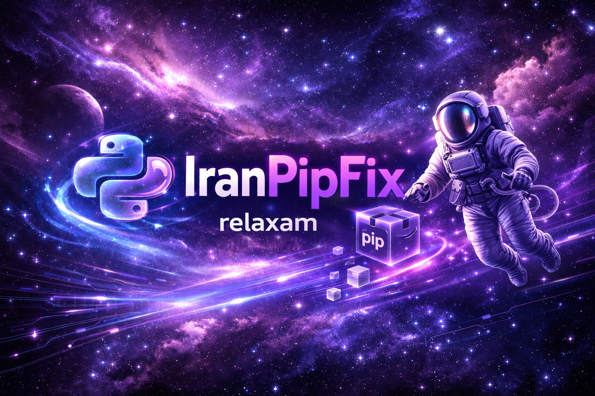

# IranPipFix — Fast Python Package Installer for Iranian Developers

 <!-- اینجا میتونی بنر حرفه‌ای که ساختیم بذاری -->

---
## 🇮🇷 درباره پروژه

این پروژه **IranPipFix** به برنامه‌نویسان ایرانی کمک می‌کند تا مشکلات رایج نصب پکیج‌های Python را حل کنند.  
با استفاده از این ابزار، مشکلاتی مانند **عدم دسترسی به PyPI، خطاهای pip و Connection Timeout** برطرف می‌شوند و نصب پکیج‌ها از طریق **میرورهای سریع داخلی و خارجی** بسیار آسان خواهد شد.

**ویژگی‌های کلیدی:**
- پشتیبانی از چندین میرور سریع: **Runflare، TUNA، Aliyun، Huawei، USTC، Douban، SDUT**  
- رابط خط فرمان ساده و کاربرپسند  
- سازگار با سیستم‌عامل‌های **Windows، Linux و macOS**
 

---

## 🌍 English Description
**IranPipFix** is a fast and reliable Python package installer designed to help developers in Iran overcome PyPI access restrictions.  
It automatically detects pip, installs missing packages, and uses high-speed mirrors for smooth installation.

**Features:**
- Support for multiple fast mirrors: Runflare, TUNA, Aliyun, Huawei, USTC, Douban, SDUT  
- User-friendly CLI interface  
- Works on Windows, Linux, macOS  

---

## 🚀 Installation / نصب
```bash
git clone https://github.com/relaxam/IranPipFix
cd IranPipFix
python3 IranPipFix.py
